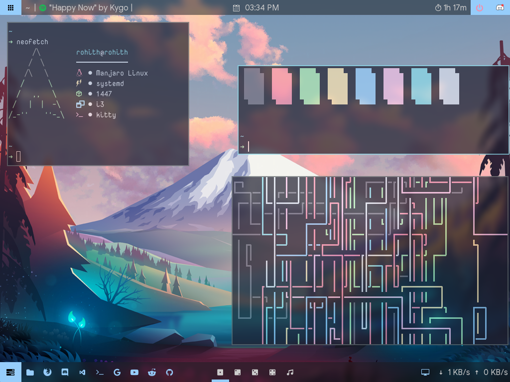
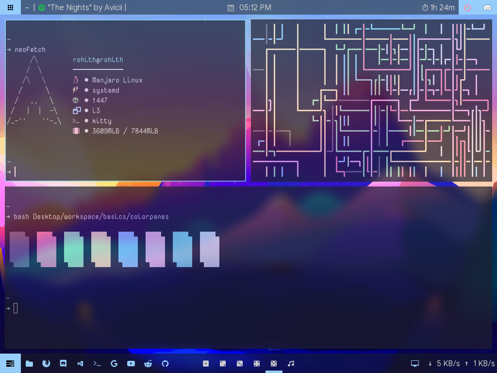
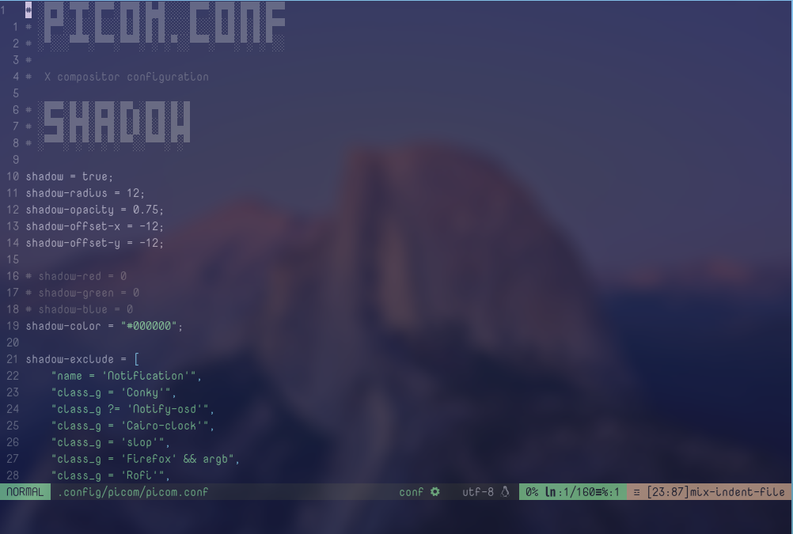

<h3 align="center">Dotfiles for my <i>awesome<i> desktop!</h3>
<hr /> 

<p align="center">
 

</p>

<h2 align="center">Desktop</h3>


### Starring

- [`manjaro`](https://manjaro.org/) as distribution
- [`i3-gaps`](https://github.com/Airblader/i3) as window manager
- [`kitty`](https://github.com/kovidgoyal/kitty) as terminal emulator
- [`picom-git`](https://github.com/yshui/picom) as compositor
- [`rofi`](https://github.com/davatorium/rofi) as application launcher
- [`polybar`](https://github.com/polybar/polybar) as bar
- [`trivago`](https://www.youtube.com/watch?v=dQw4w9WgXcQ) as hotel (shamelessly stolen)

  
### Dependencies

| Name | Description | Why/Where is it needed? |
| --- | --- | --- |
| [`i3-gaps`](https://github.com/Airblader/i3) |  Highly configurable window manager | Isn't it obvious? |
| [`rofi`](https://github.com/davatorium/rofi) | Window switcher, application launcher and dmenu replacement | Application launcher |
| [`picom-git`](https://github.com/yshui/picom) | A compositor for X11 | A compositor with kawase-blur |
| [`polybar`](https://github.com/polybar/polybar) | A fast and easy-to-use status bar  | Status bar | 
| [`feh`](https://github.com/derf/feh) |  A fast and light image viewer   | Wallpaper |
| [`dunst`](https://github.com/dunst-project/dunst) |  Lightweight and customizable notification daemon    | For notifications |
| [`spicetify`](https://github.com/spicetify/spicetify-cli) | Commandline tool to customize Spotify client | To customize spotify |
| [`better discord`](https://betterdiscord.app/) |   To enhances Discord desktop app with new features   | To customize discord |

### Color scheme and Wallpapers
Huge thanks to [Catppuccin](https://github.com/catppuccin/) for this amazing color scheme and the awesome wallpapers. All the colors used are from the *Catppuccin* color pallet
  
<p align="center"></p>
  
<p align="center"></p>

### Fonts
All the fonts used are in the [`fonts`](https://github.com/Rohith04MVK/dotfiles/tree/main/fonts) folder
  
### Installation and usage
 
  
1. Install the required dependencies for your specific distributions.
2. Clone this repository
```bash
 git clone https://github.com/Rohith04MVK/dotfiles
```
3. Install the fonts from [`fonts`](https://github.com/Rohith04MVK/dotfiles/tree/main/fonts) folder.
4. Copy all the folder from [`.config`](https://github.com/Rohith04MVK/dotfiles/tree/main/.config) to `~/.config` folder.
<h3 align="center">Walla All done! Now login with i3 🎉</h3>

### Gallary




